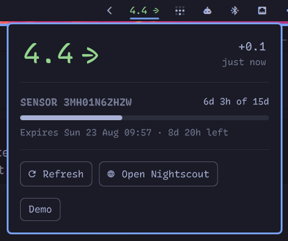
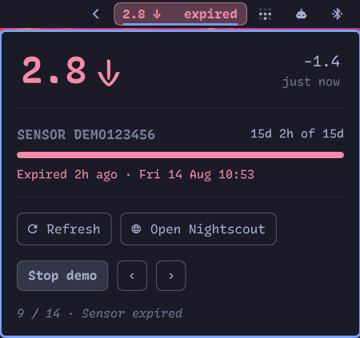

# Omascout CGM 

Current blood glucose in the bar, coloured using your own Nightscout server's
thresholds, with a popup showing the reading's age and, where it can be
derived, how much sensor life is left.

## Known issues
- Colours are fixed and not themed 


## images

### Top Bar and Panel


### Demo mode



## Install

```bash
omarchy plugin add https://github.com/vulturetone/omascout.git --enable --yes
```

Then set at least the site URL on the widget's entry in
`~/.config/omarchy/shell.json`:

```json
{ 
  "id": "vulturetone.omascout", 
  "url": "https://mysite.example.com:1337", 
  "sensorDays": 15,
  ...
}
```

Without a `url` the pill shows an error.

## Settings

Every setting is inline on the widget's `shell.json` entry. There is no
second config file.

| Key | Default | What it does |
|---|---|---|
| `url` | *(none)* | Base URL of your Nightscout site. **Required.** |
| `intervalSec` | `60` | Poll interval. Most uploaders post about once a minute; faster only adds load. |
| `tokenFile` | `~/.config/nightscout-token` | File holding a read-only access token. Optional; see below. |
| `allowInsecureAuth` | `false` | Permit sending the token to an `http://` site. See below before enabling. |
| `sensorDays` | `0` | Sensor wear time in days. `0` turns sensor tracking off entirely. |
| `warmupMins` | `60` | Warmup before a sensor's first reading, backdated to estimate activation. |
| `warnHours` | `24` | Outline the pill once this little wear time remains. |
| `staleMins` | `5` | Minutes without a reading before the pill greys out. |
| `timeoutSec` | `4` | HTTP timeout. |


## Interactions

| | |
|---|---|
| left click | popup with delta, reading age, and sensor life |
| right click | open your Nightscout site |
| middle click | refresh |

Also on IPC: `omarchy-shell vulturetone.omascout refresh|open|close|show|hide|toggle`.

The popup's **Demo** button cycles the bar and panel through every state on a loop: each glucose class, the sensor warnings, and the error
states. Handy for checking a custom palette without waiting for real glucose
to go there. Polling pauses while it runs, and closing the popup ends it, so
a fake reading can't be left sitting on the bar.

## Thresholds and units

Thresholds are read from your site's own `/api/v1/status.json`, so changing
them in Nightscout changes every client at once. Nightscout publishes them in
mg/dL and the properties endpoint returns raw mgdl alongside the
display-scaled value, so classification happens in mg/dL and the pill shows
whatever unit your site displays. If the site has never been reachable,
Nightscout's own defaults are used. Units come from the server for the same
reason, so there's no unit setting here.

Colours aren't themed, but you can override them in the  if they clash. I'll look into making it pick up themes from Omarchy in future. 

## Authentication

If reading your nightscout instance need a token, it should be placed in a file somewhere and that path should be set in shell.json using `"tokenFile":"~/path/to/tokenFile"`

Alternatively, a site running `AUTH_DEFAULT_ROLES=readable` needs no credential and works
with no `tokenFile` at all (this is how I run, as the nightscout instance is only exposed to the local network)

### Tokens require HTTPS

A token is only sent over a transport that can keep it: `https://`, or a
loopback address, where nothing reaches a network interface. Point a token at
a plain `http://` site anywhere else and the widget refuses to poll, showing
**⚠️ Insecure** rather than putting your token — and every reading behind it —
on the wire in clear text for anyone sharing the network.

Two ways out, depending on what you actually want:

- **Put the site behind HTTPS.** The real fix, and the only one that protects
  the glucose data as well as the token.
- **`"allowInsecureAuth": true`** sends it anyway. Only sensible on a network
  you genuinely trust, and it protects nothing — the readings were already
  travelling in the clear, and now the token is too.

If your site needs no token, none of this applies: a `readable` site polls over
plain `http` exactly as it always did. Note that the token file is picked up
from `~/.config/nightscout-token` even if you never set `tokenFile`, so a
leftover file there is enough to trigger the refusal — delete it if the token
is not actually in use.

### Why the token is in the URL

Where a token is sent it goes in the `?token=` query string, which does mean
it reaches your Nightscout's access logs. That is not a choice this widget
gets to make: `?token=` is the only credential its endpoints accept.

Nightscout's `Authorization: Bearer` support is real, but it is api/v3-only
and expects a JWT from `/api/v2/authorization/request/<token>`, not the access
token itself. On the v1 and v2 endpoints this widget reads, the header is
ignored — verified against 15.0.7, where a valid `?token=` populates the
response's `authorized` object while a valid Bearer JWT leaves it `null`.

Switching to api/v3 would not fix it either. `/api/v3/status` does not carry
`settings.thresholds`, and `/api/v3/properties` does not exist, so the
thresholds still have to come from v1 with `?token=` — and the display-scaled
reading, delta, and trend arrow would have to be recomputed here from raw
`sgv`, which is exactly the unit handling this widget avoids by letting the
server decide.

So the credential is protected by *where it is allowed to travel* rather than
by where it sits in the request, which is what the HTTPS rule above enforces.

## Sensor expiry

Not every uploader reports it. Juggluco, for one, forwards only the sensor
serial (in each entry's `device` field) and posts no Sensor Start/Change
treatments, so there is nothing to read. Where `sensorDays` is set, expiry
is *derived* instead: the oldest reading carrying a given serial is that
sensor's first post-warmup reading, which dates the activation. Uploaders
that backfill history on connect make this hold for sensors that predate
the Nightscout install.

That scan is expensive, so it's cached per serial and runs once per sensor
rather than once per poll. Thresholds are cached for 30 minutes.

Set `sensorDays` to `0` where the derivation does not apply, such as a site
whose uploader posts real sensor treatments, or a sensor with no fixed wear
time. The whole sensor section then disappears from the popup.

Wear times that I am aware of:  Libre 2: 14, Libre 2 Plus: 15

## Design notes

The sensor warning is additive: an outline around the pill and a suffix on
its text, not a colour change. The glucose class keeps the text colour, so an
urgent low can't be masked by a sensor that happens to be expiring at the
same time.

On a vertical bar the pill drops the trend arrow and the expiry suffix and
shrinks the number to fit the slot.

The reading is fetched by `scripts/nightscout.py`, which prints one JSON
object and is runnable by hand:

```bash
./scripts/nightscout.py --url https://mysite.example.com --sensor-days 15
```

# Disclaimer

Omascout is not a medical application and is not approved or certified by any healthcare regulator. It displays data you already have, for information only.

Do not use it to diagnose, treat, or make dosing decisions. Check your healthcare provider recommended methods.

Provided as is, without warranty of any kind, and used at your own risk. Not
affiliated with or endorsed by any other company or organization.
